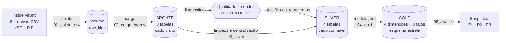
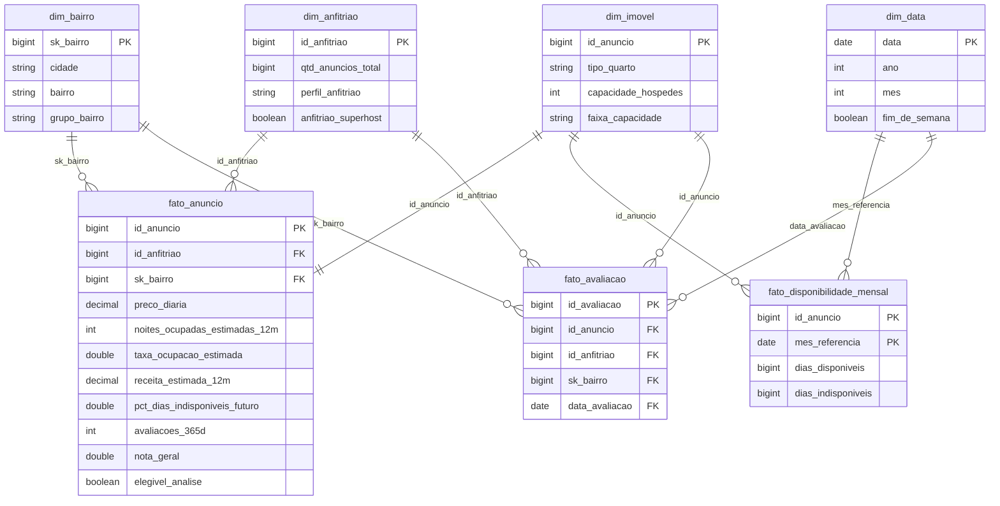
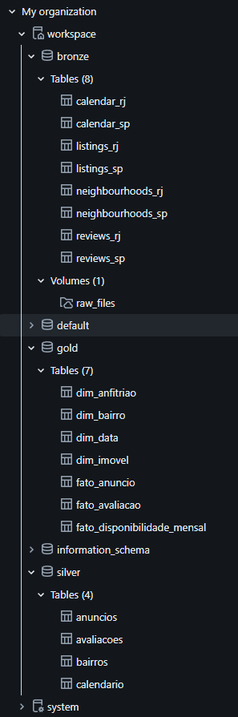
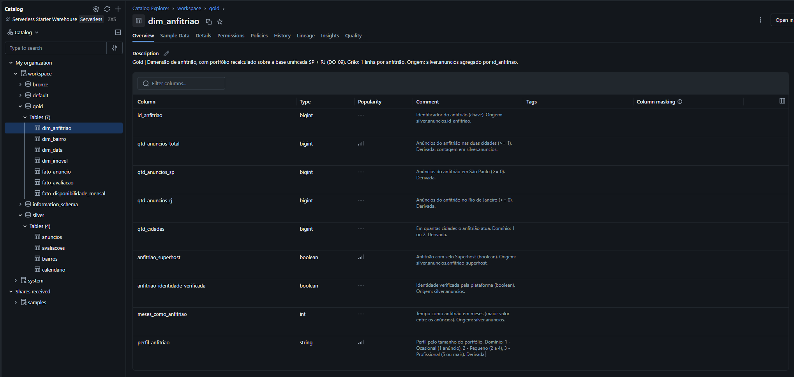
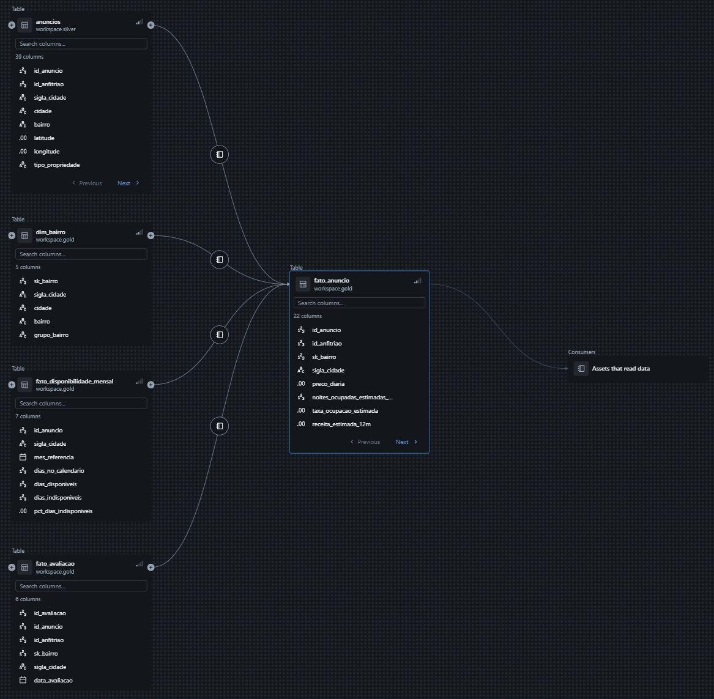
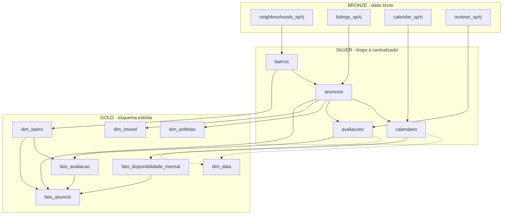
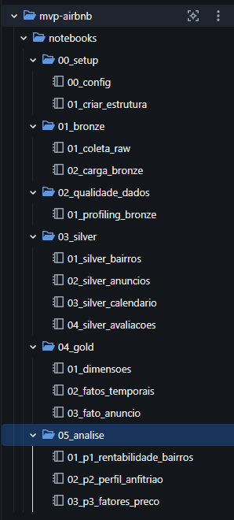
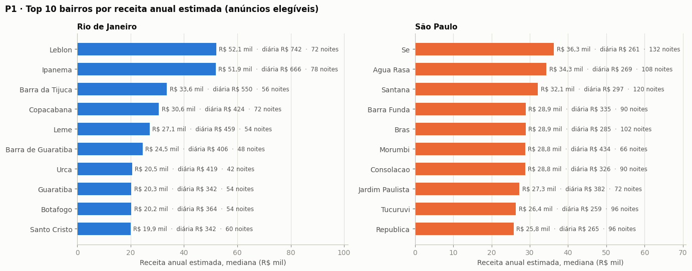
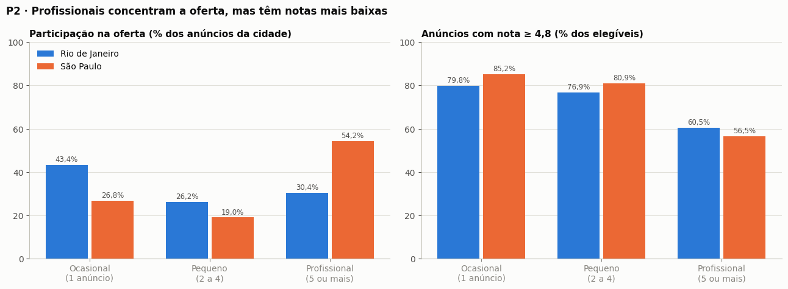
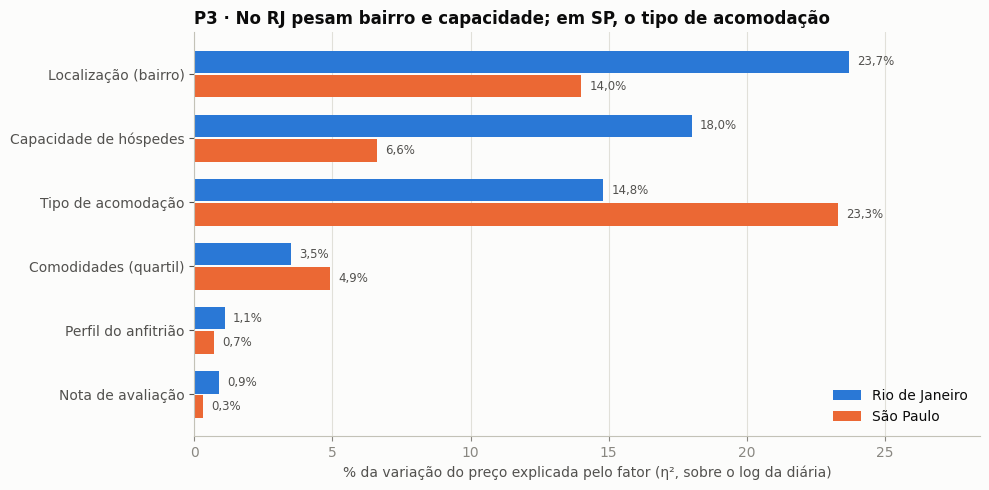

# MVP · Pipeline de Dados na Nuvem — Airbnb em São Paulo e Rio de Janeiro

Pipeline de dados construído no **Databricks Free Edition**, em arquitetura medalhão (Bronze → Silver → Gold), para entender o que
determina a **rentabilidade** e a **precificação** dos imóveis no mercado de aluguel por temporada das duas maiores cidades do país.

| | |
|---|---|
| **Fonte** | [Inside Airbnb](https://insideairbnb.com/get-the-data/) (CC BY 4.0) — São Paulo (snapshot 2026-06-14) e Rio de Janeiro (2026-06-24) |
| **Volume** | 91.067 anúncios · 33,3 milhões de dias de calendário · 2,97 milhões de avaliações |
| **Plataforma** | Databricks Free Edition (compute serverless, Unity Catalog, Delta Lake) |
| **Código** | Notebooks PySpark/SQL em [`notebooks/`](notebooks/), executados em ordem numérica |

### Visão geral do pipeline



---

## Sumário
1. [Contexto de Negócios e Perguntas (Etapa 2 e 4.1)](#1-contexto-de-negócios-e-perguntas-etapa-2-e-41)
2. [Carga dos Dados (Etapa 4.2)](#2-carga-dos-dados-etapa-42)
3. [Modelagem e Catálogo de Dados (Etapa 4.3)](#3-modelagem-e-catálogo-de-dados-etapa-43)
4. [Pipeline de Dados (Etapa 4.4)](#4-pipeline-de-dados-etapa-44)
5. [Qualidade de Dados (Etapa 4.5)](#5-qualidade-de-dados-etapa-45)
6. [Análise de Dados (Etapa 4.5)](#6-análise-de-dados-etapa-45)
7. [Autoavaliação](#7-autoavaliação)
8. [Como executar](#8-como-executar)

---

## 1. Contexto de Negócios e Perguntas (Etapa 2 e 4.1)

### Problema
Quero entender **o que determina a rentabilidade e a precificação de imóveis no mercado de aluguel por temporada (Airbnb) no Rio de
Janeiro e em São Paulo**. Um investidor ou anfitrião que olha apenas o preço da diária pode tomar decisões erradas: um imóvel caro e
vazio rende menos que um mais barato e sempre ocupado. Além disso, os dois mercados têm naturezas diferentes (turismo de praia ×
viagens urbanas e corporativas), e não é óbvio que as mesmas regras de preço valham para ambos.

**Para quem é esta análise:** anfitriões e investidores que avaliam onde e como anunciar um imóvel, e quem acompanha o impacto do
aluguel por temporada nas duas cidades (a concentração de imóveis nas mãos de operadores profissionais é um tema recorrente no
debate sobre moradia).

**Escopo:** anúncios ativos no Airbnb nos municípios de São Paulo e do Rio de Janeiro, no snapshot de junho de 2026 (um retrato do
mercado, com ocupação e receita estimadas para os 12 meses anteriores e disponibilidade para os 12 meses seguintes). Ficam fora
outras plataformas, o aluguel tradicional e a evolução ao longo dos anos.

**Hipóteses de partida:**
- H1: os bairros mais caros não são necessariamente os mais rentáveis, porque ocupação e preço podem se compensar (P1).
- H2: anfitriões profissionais praticam preços diferentes e têm uma reputação diferente da dos ocasionais (P2).
- H3: como os dois mercados têm naturezas diferentes, os fatores que definem o preço têm pesos diferentes em cada cidade (P3).

### Perguntas de negócio
| # | Pergunta |
|---|---|
| **P1** | Quais bairros geram maior retorno para um anfitrião, considerando não só o preço da diária, mas a ocupação ao longo do ano? |
| **P2** | Anfitriões com vários imóveis ("profissionais") praticam preços e recebem avaliações diferentes dos anfitriões com um único imóvel ("ocasionais")? Esse perfil está concentrado em bairros específicos? |
| **P3** | As características que mais influenciam o preço (localização, tipo de imóvel, capacidade, avaliação) têm o mesmo peso no Rio e em São Paulo, ou cada mercado responde a fatores diferentes? |

### Os dados brutos
O [Inside Airbnb](https://insideairbnb.com) é um projeto independente que coleta periodicamente os anúncios públicos do Airbnb em
dezenas de cidades e publica os dados para pesquisa e debate público. Ele foi escolhido, em vez de datasets do Kaggle, por ser
**atual** (os datasets brasileiros de imóveis no Kaggle têm de 2 a 7 anos) e por trazer **várias tabelas relacionadas** (anúncios,
calendário, avaliações e bairros), o que permite construir um pipeline com junções, agregações e um modelo dimensional de verdade. Foram usados os snapshots mais recentes das duas cidades
(junho de 2026), com quatro arquivos por cidade:

| Arquivo | Grão | Colunas | Linhas SP | Linhas RJ | Conteúdo principal |
|---|---|---|---|---|---|
| `listings.csv.gz` | anúncio | 90 | 42.354 | 48.713 | imóvel, anfitrião, bairro, preço, estadia mínima, notas, ocupação e receita estimadas |
| `calendar.csv.gz` | anúncio × dia | 5 | 15.467.973 | 17.786.085 | disponibilidade diária nos 365 dias seguintes à coleta |
| `reviews.csv.gz` | avaliação | 6 | 1.577.515 | 1.388.472 | data, anúncio e texto de cada avaliação |
| `neighbourhoods.csv` | bairro | 2 | 96 | 160 | lista oficial de bairros (e subprefeituras em SP) |

### Licença
Os dados são publicados sob a licença **[Creative Commons Attribution 4.0 International](https://creativecommons.org/licenses/by/4.0/)**:
podem ser usados, transformados e compartilhados livremente, inclusive para fins comerciais, desde que a fonte seja citada. Este
trabalho atribui a autoria ao Inside Airbnb em todas as tabelas (comentários no catálogo) e neste documento. Os dados não são
redistribuídos no repositório (a pasta local de dados está no `.gitignore`). Nomes de avaliadores e textos de avaliações foram
descartados já na Silver, por minimização de dados pessoais.

---

## 2. Carga dos Dados (Etapa 4.2)

A coleta foi feita por **script**, em duas etapas separadas (Extract e Load):

1. **Coleta dos arquivos → Volume** ([`01_bronze/01_coleta_raw`](notebooks/01_bronze/01_coleta_raw.py)).
   Baixa os 8 arquivos direto das URLs da fonte para o Volume `workspace.bronze.raw_files` do Unity Catalog, organizados em
   `<cidade>/<data do snapshot>/<arquivo>`. O arquivo original fica guardado sem alteração, como evidência do que a fonte entregou e
   para permitir reprocessar a Bronze sem baixar de novo. O notebook é idempotente: arquivos já existentes não são baixados outra vez.
   Como alternativa, o script [`scripts/coleta_via_cli.ps1`](scripts/coleta_via_cli.ps1) faz o mesmo pela máquina local, com o
   Databricks CLI, caso o compute não tenha acesso à internet.
2. **Arquivos → tabelas Bronze** ([`01_bronze/02_carga_bronze`](notebooks/01_bronze/02_carga_bronze.py)).
   Lê cada CSV com Spark e grava uma tabela Delta por arquivo e cidade (`bronze.listings_sp`, `bronze.listings_rj`, …), com **todas as
   colunas como texto** (cópia fiel) e quatro metadados de linhagem: `_cidade`, `_data_snapshot`, `_arquivo_origem` e `_ingerido_em`.
   A leitura usa `multiLine` e `escape='"'` porque descrições e comentários têm quebras de linha e aspas.

A estrutura (schemas `bronze`, `silver`, `gold` e o Volume) é criada por [`00_setup/01_criar_estrutura`](notebooks/00_setup/01_criar_estrutura.py).

**Resultado da carga:** 8 arquivos no Volume e 8 tabelas Bronze, com as mesmas quantidades de linhas dos arquivos da fonte
(tabela da seção 1): 91.067 anúncios, 33.254.058 dias de calendário, 2.965.987 avaliações e 256 bairros.

---

## 3. Modelagem e Catálogo de Dados (Etapa 4.3)

### Organização em camadas (arquitetura medalhão)
| Camada | Schema | Tabelas | Papel |
|---|---|---|---|
| Bronze | `workspace.bronze` | 8 tabelas (entidade × cidade) + Volume `raw_files` | dado como veio da fonte, em texto, com metadados de ingestão |
| Silver | `workspace.silver` | `bairros`, `anuncios`, `calendario`, `avaliacoes` | SP + RJ centralizados, tipados, validados, com flags de qualidade |
| Gold | `workspace.gold` | 4 dimensões + 3 fatos | modelo dimensional pronto para as perguntas |

### Modelo da Gold: esquema estrela com três tabelas fato
A Gold segue um **esquema estrela com múltiplas tabelas fato** (constelação): três fatos, em grãos diferentes, compartilham as mesmas
dimensões. O fato central tem 1 linha por anúncio; os outros dois guardam a dimensão temporal (disponibilidade por mês e avaliações).



| Tabela | Grão | Linhas | Como é construída |
|---|---|---|---|
| `dim_bairro` | cidade + bairro | 256 | `silver.bairros` + chave substituta (hash) |
| `dim_anfitriao` | anfitrião | 43.336 | `silver.anuncios` **agregado** com SP e RJ juntos → portfólio e perfil (1 / 2–4 / 5 ou mais anúncios) |
| `dim_imovel` | anúncio | 91.067 | atributos descritivos de `silver.anuncios` + faixa de capacidade |
| `dim_data` | dia | 6.233 | sequência de datas gerada (2010-06-07 a 2027-06-30) |
| `fato_anuncio` | anúncio | 91.067 | `silver.anuncios` + `dim_bairro` + resumos de `fato_disponibilidade_mensal` e `fato_avaliacao` |
| `fato_disponibilidade_mensal` | anúncio × mês | 1.179.958 | `silver.calendario` **agregado** por mês (33,2 mi de linhas diárias) |
| `fato_avaliacao` | avaliação | 2.964.344 | `silver.avaliacoes` **enriquecida** com anfitrião e bairro |

**Decisões de modelagem:**
- **Rentabilidade = receita bruta anual estimada** (diária × noites ocupadas estimadas pela fonte). A base não traz o valor dos
  imóveis, então não é possível calcular retorno sobre o investimento.
- **Portfólio recalculado com as duas cidades juntas:** a contagem da fonte é por cidade, e 192 anfitriões atuam nas duas.
- **Bairro identificado por cidade + nome:** "Campo Grande" e "Penha" existem em SP e no RJ (256 bairros, 254 nomes), por isso
  `dim_bairro` usa uma chave substituta (`sk_bairro`) gerada a partir da sigla da cidade e do nome do bairro.
- **`elegivel_analise`:** consolida as flags da Silver (preço válido, sem outlier, estadia mínima < 30 noites, ativo em 12 meses) e
  define a base das análises de preço (30.761 anúncios no RJ e 32.041 em SP).

### Catálogo de dados
O catálogo foi gravado **no próprio Unity Catalog pelos notebooks** (`COMMENT ON TABLE` e `ALTER TABLE … ALTER COLUMN … COMMENT`), de
modo que a documentação nasce junto com a tabela. Para cada tabela há contexto, grão e origem; para cada coluna há descrição, tipo,
**domínio de valores** e **linhagem** (tabela e coluna de origem ou regra de derivação). A linhagem entre tabelas também é registrada
automaticamente pelo Unity Catalog (aba *Lineage*).

**A transcrição completa, coluna a coluna, está em [`docs/catalogo_de_dados.md`](docs/catalogo_de_dados.md)**, com o domínio
**observado** nos dados reais (mínimo e máximo ou categorias), o % de nulos e o destino na Silver de cada coluna da Bronze (ou o
motivo do descarte). Exemplo (`gold.fato_anuncio`):

| Coluna | Tipo | Descrição, domínio e linhagem |
|---|---|---|
| `id_anuncio` | bigint | Identificador do anúncio (chave); chave estrangeira para dim_imovel. |
| `preco_diaria` | decimal(12,2) | Preço da diária em BRL (NULL quando a fonte não informa, DQ-05). Origem: silver.anuncios. |
| `noites_ocupadas_estimadas_12m` | int | Noites ocupadas nos últimos 12 meses estimadas pela fonte (0 a 255). Origem: silver.anuncios. |
| `taxa_ocupacao_estimada` | double | noites_ocupadas_estimadas_12m / 365 (0 a ~0,70). Derivada. |
| `receita_estimada_12m` | decimal(14,2) | Receita bruta anual estimada em BRL = preco_diaria × noites_ocupadas_estimadas_12m. Derivada. |
| `pct_dias_indisponiveis_futuro` | double | Parcela dos próximos 12 meses reservada ou bloqueada (0 a 1). Derivada de fato_disponibilidade_mensal. |
| `elegivel_analise` | boolean | true quando preço válido e anúncio ativo, sem outlier e sem estadia longa. Derivada. |

**Tabelas persistidas no Unity Catalog** (schemas `bronze`, `silver` e `gold`):



**Catálogo de dados no Unity Catalog** — descrição, tipo, domínio e origem de cada coluna, no exemplo da `gold.dim_anfitriao`
(todas as tabelas seguem o mesmo padrão; a transcrição completa está em `docs/catalogo_de_dados.md`):



**Linhagem registrada automaticamente pelo Unity Catalog** — de onde vêm os dados da `gold.fato_anuncio`:



---

## 4. Pipeline de Dados (Etapa 4.4)

O pipeline foi **dividido em um notebook por etapa de ETL**: cada um lê uma ou mais tabelas, transforma e grava outra. As pastas
correspondem às camadas. A exceção é `02_qualidade_dados`, que é um **diagnóstico entre a Bronze e a Silver**: ele não é uma camada e
não grava tabelas, apenas mede os problemas que justificam as transformações da Silver.

| Ordem | Notebook | Lê | Grava |
|---|---|---|---|
| — | [`00_setup/00_config`](notebooks/00_setup/00_config.py) | — | nada: parâmetros e funções compartilhadas, carregadas por `%run` em todos os notebooks |
| 1 | [`00_setup/01_criar_estrutura`](notebooks/00_setup/01_criar_estrutura.py) | — | schemas `bronze`, `silver`, `gold` e Volume `raw_files` |
| 2 | [`01_bronze/01_coleta_raw`](notebooks/01_bronze/01_coleta_raw.py) | URLs da fonte | 8 arquivos no Volume |
| 3 | [`01_bronze/02_carga_bronze`](notebooks/01_bronze/02_carga_bronze.py) | Volume | 8 tabelas Bronze |
| 4 | [`02_qualidade_dados/01_profiling_bronze`](notebooks/02_qualidade_dados/01_profiling_bronze.py) | Bronze | nada: diagnóstico DQ-01 a DQ-17 |
| 5 | [`03_silver/01_silver_bairros`](notebooks/03_silver/01_silver_bairros.py) | `bronze.neighbourhoods_*` | `silver.bairros` |
| 6 | [`03_silver/02_silver_anuncios`](notebooks/03_silver/02_silver_anuncios.py) | `bronze.listings_*`, `silver.bairros` | `silver.anuncios` |
| 7 | [`03_silver/03_silver_calendario`](notebooks/03_silver/03_silver_calendario.py) | `bronze.calendar_*`, `silver.anuncios` | `silver.calendario` |
| 8 | [`03_silver/04_silver_avaliacoes`](notebooks/03_silver/04_silver_avaliacoes.py) | `bronze.reviews_*`, `silver.anuncios` | `silver.avaliacoes` |
| 9 | [`04_gold/01_dimensoes`](notebooks/04_gold/01_dimensoes.py) | Silver | `dim_bairro`, `dim_anfitriao`, `dim_imovel`, `dim_data` |
| 10 | [`04_gold/02_fatos_temporais`](notebooks/04_gold/02_fatos_temporais.py) | Silver + `dim_bairro` | `fato_disponibilidade_mensal`, `fato_avaliacao` |
| 11 | [`04_gold/03_fato_anuncio`](notebooks/04_gold/03_fato_anuncio.py) | Silver + Gold | `fato_anuncio` |
| 12–14 | [`05_analise/`](notebooks/05_analise/) | Gold | nada: respostas P1, P2 e P3 |

**Principais transformações, por camada:**
- **Bronze → Silver:** centralização SP + RJ (`unionByName`), seleção explícita de colunas e nomes em português, conversão de tipos
  com `try_cast` (preço `$1,250.00` → decimal, `t`/`f` → boolean, IDs → BIGINT), remoção de registros inválidos (sem chave, fora do
  município, capacidade ≤ 0, datas impossíveis, órfãos, duplicados), **flags** para restrições analíticas (sem apagar dados) e
  descarte de dados pessoais.
- **Silver → Gold:** agregações (portfólio por anfitrião; calendário diário → mensal), junções (bairro e anfitrião nas avaliações;
  resumos do calendário e das avaliações no fato central), métricas derivadas (taxa de ocupação, receita) e chaves substitutas.

**Boas práticas aplicadas:**
- **Idempotência:** toda gravação usa `overwrite`, e a estrutura usa `IF NOT EXISTS`; rodar de novo não duplica dados.
- **Validação após cada carga:** `validar_chave` interrompe o pipeline se a chave tiver nulos ou duplicados. Na Gold, também se
  verifica que toda linha da fato encontra sua dimensão e que as contagens recalculadas batem com a fonte.
- **Impacto documentado:** cada filtro imprime quantas linhas entraram e quantas saíram.
- **Resultados reprodutíveis:** toda amostra e agrupamento exibidos têm ordenação fixa.

**Fluxo entre as tabelas** (cada seta é uma leitura feita por um notebook; as pontilhadas só definem o período da `dim_data`):



**Validações executadas na carga** (todas passaram):

| Etapa | Verificação | Resultado |
|---|---|---|
| Silver | Chave única e não nula em `bairros`, `anuncios`, `calendario` e `avaliacoes` | OK (256 · 91.067 · 33.239.458 · 2.964.344 linhas) |
| Silver | Falhas de conversão de tipo em `anuncios` | 0 em todas as colunas verificadas |
| Silver | Anúncios com bairro fora da lista oficial | 0 |
| Gold | Chave única e não nula nas 7 tabelas | OK |
| Gold | Linhas da `fato_anuncio` sem correspondência em `dim_bairro`, `dim_anfitriao` e `dim_imovel` | 0 · 0 · 0 |
| Gold | Avaliações dos últimos 365 dias recalculadas × contagem da fonte | iguais em 91.066 de 91.067 anúncios |

**Notebooks no Workspace do Databricks**, organizados por camada:



---

## 5. Qualidade de Dados (Etapa 4.5)

A verificação foi feita **sobre a Bronze, antes de qualquer transformação**
([`02_qualidade_dados/01_profiling_bronze`](notebooks/02_qualidade_dados/01_profiling_bronze.py)), cobrindo completude,
consistência, unicidade, acurácia, outliers e integridade entre tabelas. Cada problema recebeu um código (`DQ-xx`), citado depois no
código da Silver onde o tratamento é aplicado.

| Código | Dimensão | Problema encontrado | Tratamento |
|---|---|---|---|
| DQ-01 | Consistência | Tudo em texto: preço `$1,250.00` (em reais, apesar do `$`), `t`/`f`, datas, comodidades em JSON | Conversão com `try_cast` na Silver; 0 falhas de conversão |
| DQ-02 | Consistência | IDs de 18–19 dígitos: 73.058 mudariam de valor se lidos como `double` | Bronze em texto → `BIGINT` na Silver |
| DQ-03 | Consistência | O layout da fonte muda entre versões | `unionByName` + seleção explícita de colunas |
| DQ-04 | Completude | `neighbourhood` 100% vazio; agrupamento de bairros só em SP | Bairro = `neighbourhood_cleansed`; subprefeitura só como atributo |
| DQ-05 | Completude | Sem preço: 522 anúncios em SP (1,2%) e 4.171 no RJ (8,6%), em geral parados | Mantidos com flag `preco_valido` |
| DQ-06 | Outliers | Diárias de até R$ 574.013 (9 dos 10 maiores sem avaliação no ano) e mínimas de R$ 5,54 | Flag `outlier_preco` (Tukey no log do preço, por cidade e tipo de quarto): 2.377 em SP, 1.516 no RJ |
| DQ-07 | Acurácia / perfil | 1.204 anúncios exigem ≥ 30 noites (até 730); 24.353 sem avaliação em 12 meses | Flags `estadia_longa` e `anuncio_ativo` (registros válidos, não removidos) |
| DQ-08 | Completude | 15.594 anúncios sem nota — exatamente os nunca avaliados | Mantido NULL, sem imputação |
| DQ-09 | Consistência | Contagem de anúncios por anfitrião diverge em 42% dos anúncios; 192 anfitriões nas 2 cidades | Portfólio recalculado na Gold com as duas cidades |
| DQ-10 | Completude | Calendário sem colunas de preço nesta versão da fonte | Diária vem de `listings`; checagem de existência da coluna |
| DQ-11 | Acurácia | Calendário é futuro e "indisponível" mistura reservado e bloqueado | Ocupação estimada da fonte como métrica principal |
| DQ-12 | Privacidade | Nome do avaliador e texto das avaliações | Colunas removidas na Silver |
| DQ-13 | Integridade | 40 anúncios órfãos no calendário e 35 nas avaliações | Semi-join: 14.600 dias e 1.643 avaliações removidos |
| DQ-14 | Unicidade | Nenhuma chave duplicada encontrada | Deduplicação defensiva + validação pós-carga |
| DQ-15 | Acurácia | Coordenadas, capacidade e datas dentro do esperado | Regras mantidas como filtros de proteção (0 removidos) |
| DQ-16 | Completude | 12 colunas 100% vazias (ex.: `host_since`, `host_response_rate`, `instant_bookable`) | Excluídas; tempo de anfitrião via `hosts_time_as_host_*` |
| DQ-17 | Acurácia | A coleta dura dias (RJ: 25/06 a 01/07): datas passam da data do snapshot | Limite de datas = fim da coleta; evitou descartar 299 avaliações válidas |

**Princípio adotado:** a Silver **remove apenas o que está errado** (e registra o impacto). O que é válido, mas inadequado para uma
análise específica (preço ausente, outlier, estadia mensal, anúncio parado), recebe uma **flag**, e o filtro é aplicado de forma
explícita na Gold (`elegivel_analise`). Assim nenhuma informação é perdida e cada exclusão é justificável.

---

## 6. Análise de Dados (Etapa 4.5)

Todas as análises usam a Gold e só os **anúncios elegíveis** (30.761 no RJ e 32.041 em SP), com **medianas** para não sofrer com
valores extremos. Mediana geral dos elegíveis: diária de R$ 411 (RJ) e R$ 327 (SP); 54 e 66 noites ocupadas por ano; receita anual
de R$ 23,1 mil e R$ 22,1 mil.

### P1 · Quais bairros geram maior retorno?
[`05_analise/01_p1_rentabilidade_bairros`](notebooks/05_analise/01_p1_rentabilidade_bairros.py) — ranking pela mediana da receita
anual estimada, com bairros de pelo menos 30 anúncios elegíveis (50 por cidade).

| # | Rio de Janeiro | Receita anual | Diária | Noites | São Paulo | Receita anual | Diária | Noites |
|---|---|---|---|---|---|---|---|---|
| 1 | Leblon | R$ 52.091 | R$ 742 | 72 | Sé | R$ 36.288 | R$ 261 | 132 |
| 2 | Ipanema | R$ 51.912 | R$ 666 | 78 | Água Rasa | R$ 34.320 | R$ 269 | 108 |
| 3 | Barra da Tijuca | R$ 33.550 | R$ 550 | 56 | Santana | R$ 32.136 | R$ 297 | 120 |
| 4 | Copacabana | R$ 30.576 | R$ 424 | 72 | Barra Funda | R$ 28.922 | R$ 335 | 90 |
| 5 | Leme | R$ 27.135 | R$ 459 | 54 | Brás | R$ 28.896 | R$ 285 | 102 |

- **No Rio, preço e rentabilidade andam mais juntos** (correlação de 0,62 entre os rankings de diária e de receita). Leblon, Ipanema e
  Copacabana combinam diária alta com ocupação acima da mediana. Mesmo assim, 6 dos 10 bairros mais caros ficam fora do top 10 de
  receita: São Conrado tem a 2ª maior diária (R$ 744), mas só 12 noites ocupadas, e cai para 37º em receita.
- **Em São Paulo, os bairros mais rentáveis não são os mais caros** (correlação de 0,37). Lideram bairros do centro e das zonas
  norte e leste, fora do eixo mais valorizado, com diárias modestas e as maiores ocupações da cidade (90 a 132 noites). Sete dos 10
  bairros mais caros ficam fora do top 10 de receita.
- Nas duas cidades, a **ocupação de um bairro quase não tem relação com a sua diária** (correlação de 0,10 no RJ e −0,11 em SP).

**Resposta:** Leblon, Ipanema, Barra da Tijuca e Copacabana no RJ; Sé, Água Rasa, Santana, Barra Funda e Brás em SP. Escolher pelo
preço da diária levaria a decisões erradas, principalmente em São Paulo.

*Nota:* a fonte publica os distritos de SP sem acento (`Se`, `Agua Rasa`, `Bras`), grafia que aparece nas tabelas e nos gráficos.



### P2 · Anfitrião profissional × ocasional
[`05_analise/02_p2_perfil_anfitriao`](notebooks/05_analise/02_p2_perfil_anfitriao.py) — perfis: ocasional (1 anúncio), pequeno (2 a 4),
profissional (5 ou mais), contando SP e RJ juntos.

| Cidade | Perfil | % dos anfitriões | % dos anúncios | Diária mediana | Noites | Receita mediana | Nota média | % com nota ≥ 4,8 |
|---|---|---|---|---|---|---|---|---|
| RJ | Ocasional | 76,4% | 43,4% | R$ 439 | 48 | R$ 21.259 | 4,86 | 79,8% |
| RJ | Profissional | 4,5% | 30,4% | R$ 407 | 66 | R$ 27.054 | 4,75 | 60,5% |
| SP | Ocasional | 71,6% | 26,8% | R$ 318 | 72 | R$ 23.112 | 4,88 | 85,2% |
| SP | Profissional | 7,6% | **54,2%** | R$ 335 | 66 | R$ 21.960 | 4,72 | 56,5% |

- **Concentração:** poucos profissionais controlam grande parte da oferta, e **mais da metade dos anúncios de São Paulo**.
- **Preço:** praticamente igual entre perfis (diferença abaixo de 4% comparando só imóveis inteiros).
- **Ocupação e receita:** no RJ, os profissionais ocupam e faturam mais (+38% de receita em imóveis inteiros); em SP, não.
- **Reputação:** é a diferença mais consistente. Os profissionais têm notas menores nas duas cidades, e a parcela de anúncios com
  nota 4,8 ou mais cai cerca de 20 pontos percentuais no RJ e 29 em SP.
- **Onde estão:** em SP, a participação profissional é alta em toda a cidade (mediana de 43% por bairro) e maior nos bairros mais
  disputados: Moema (67%), Itaim Bibi (65%), Vila Mariana (60%), Jardim Paulista e Pinheiros. No RJ ela é menor (mediana de 24%),
  com destaque para Ipanema (43%), Leblon (41%) e Centro (38%).

**Resposta:** sim, os perfis se diferenciam, mas pela **escala e pela reputação**, não pelo preço; a concentração é maior nos bairros
nobres de SP e na Zona Sul do Rio.



### P3 · Os mesmos fatores explicam o preço nas duas cidades?
[`05_analise/03_p3_fatores_preco`](notebooks/05_analise/03_p3_fatores_preco.py) — para cada fator, a parcela da variação do log da
diária que ele explica sozinho (η²).

| Fator | Rio de Janeiro | São Paulo |
|---|---|---|
| Localização (bairro) | **23,7%** | 14,0% |
| Capacidade de hóspedes | 18,0% | 6,6% |
| Tipo de acomodação | 14,8% | **23,3%** |
| Comodidades | 3,6% | 4,8% |
| Perfil do anfitrião | 1,1% | 0,7% |
| Nota de avaliação | 0,9% | 0,3% |

- **Rio de Janeiro: o preço depende de onde e para quantos.** O bairro mais caro tem diária mediana 7,4 vezes a do mais barato, e um
  imóvel para 7 ou mais hóspedes custa 2,7 vezes um para 1 ou 2 (R$ 839 × R$ 310): mercado turístico, de praia, de grupos e famílias.
- **São Paulo: o preço depende do tipo de hospedagem.** Imóvel inteiro custa praticamente o dobro de um quarto (R$ 338 × R$ 172); os
  bairros são mais homogêneos (2,5 vezes entre o mais caro e o mais barato) e a capacidade pesa pouco (1,5 vez): mercado de estadias
  curtas e individuais.
- **A nota e o perfil do anfitrião quase não explicam o preço** em nenhuma das cidades.

**Resposta:** os fatores são os mesmos, mas **o peso muda**: no Rio dominam localização e capacidade; em São Paulo, o tipo de acomodação.

*Limitações:* η² mede cada fator isoladamente (os valores não se somam nem isolam causas), e o bairro, por ter mais grupos (51),
tende a ter o η² levemente inflado; com ~30 mil anúncios por cidade, esse viés é pequeno.



### Discussão geral
As três respostas contam uma história coerente sobre dois mercados diferentes. **O Rio é um mercado de destino**: o preço é
definido pela localização (a praia) e pelo tamanho do grupo, a rentabilidade se concentra na Zona Sul e na Barra da Tijuca, onde preço e
ocupação altos coexistem, e os operadores profissionais conseguem ocupar mais. **São Paulo é um mercado de conveniência**: preços mais homogêneos
entre bairros, definidos principalmente pelo tipo de hospedagem, e a rentabilidade vem da **ocupação**, não da diária, o que favorece
bairros de ocupação alta fora do eixo mais caro (centro e zonas norte e leste). Nos dois casos, olhar apenas o preço da diária é enganoso: a receita depende da ocupação, que
quase não se relaciona com o preço. Por fim, a profissionalização (54% da oferta em SP) não se traduz em preços mais altos, mas vem
acompanhada de avaliações piores, um ponto de atenção para a experiência do hóspede e, indiretamente, para o debate sobre o impacto
do Airbnb no mercado de moradia desses bairros.

---

## 7. Autoavaliação

**Objetivos.** O pipeline foi construído de ponta a ponta na nuvem e as três perguntas definidas no início foram respondidas, sem
alterar o objetivo original. Duas respostas ficaram mais estreitas do que as perguntas sugerem: "rentabilidade" virou **receita
bruta anual estimada**, porque a base não tem o valor nem os custos dos imóveis; e a ocupação usada é uma **estimativa da própria
fonte**, não a ocupação real.

**Escolha do tema e das perguntas.** O tema passou por algumas iterações. Os primeiros datasets considerados (imóveis e ações no
Kaggle) tinham de 2 a 7 anos; restringi a busca a dados de até 2 anos. Um dataset da B3, com perguntas sobre o efeito da pandemia,
chegou a ser avaliado, mas não despertou interesse suficiente. O Inside Airbnb foi escolhido por ser atual e por ter várias tabelas
relacionadas, o que permite exercitar filtros, junções e tabelas construídas a partir de outras. As perguntas também foram
reformuladas para exigir esse trabalho de engenharia: em vez de "qual bairro é mais caro", P1 cruza preço com ocupação, e P2 depende
de recalcular o portfólio dos anfitriões juntando as duas cidades.

**Dúvidas sobre os dados.** Boa parte do aprendizado veio de questionar o que os dados mostravam:
- **Calendário sem preço:** a documentação e os exemplos da internet descrevem colunas de preço no calendário; na amostra real
  elas simplesmente não existiam, e o notebook da Silver teve de ser ajustado para não quebrar.
- **Estadia mínima de 730 noites:** parecia erro, mas a análise mostrou que é uma configuração válida, usada em geral para
  "desativar" o anúncio sem apagá-lo. A decisão foi marcar esses casos com uma flag, e não excluí-los como outliers.
- **Taxas de resposta como `100%` / `N/A`:** o formato esperado não aparecia. A coluna, junto com outras 11, está 100% vazia
  nesta versão da fonte.
- **Datas depois do snapshot:** a coleta dura vários dias; usar a data do snapshot como limite teria descartado 299 avaliações
  válidas.

**O maior desafio: suposições × dados reais.** Os primeiros textos do notebook de qualidade foram escritos com base no que a
documentação da fonte descreve, e vários estavam errados quando os dados reais foram lidos (bairro em texto livre, `N/A`, preço no
calendário). A solução foi mudar o processo: rodar o pipeline localmente com os mesmos arquivos do Databricks, conferir cada
número e só então escrever as conclusões, com ordenação fixa em todas as amostras para que os resultados fossem reproduzíveis nos
dois ambientes. Também houve dúvida sobre onde encaixar a qualidade de dados na arquitetura medalhão; a conclusão foi que ela é um
diagnóstico entre a Bronze e a Silver, e não uma camada.

**Próximos passos.** Carregar vários snapshots trimestrais do Inside Airbnb, para acompanhar a evolução da ocupação, dos preços e
da profissionalização ao longo do tempo, e cruzar a receita estimada com o preço de venda do m² por bairro (ex.: índice FipeZAP),
transformando a receita bruta em retorno real sobre o investimento.

---

## 8. Como executar
1. Criar a conta no [Databricks Free Edition](https://www.databricks.com/learn/free-edition) e autenticar o CLI (`databricks auth login`).
2. Importar os notebooks:
   ```powershell
   $usuario = (databricks current-user me -o json | ConvertFrom-Json).userName
   databricks workspace import-dir .\notebooks "/Workspace/Users/$usuario/mvp-airbnb/notebooks" --overwrite
   ```
3. Executar os notebooks na ordem da tabela da seção 4 (compute **Serverless**). O `00_config` não precisa ser executado sozinho.
